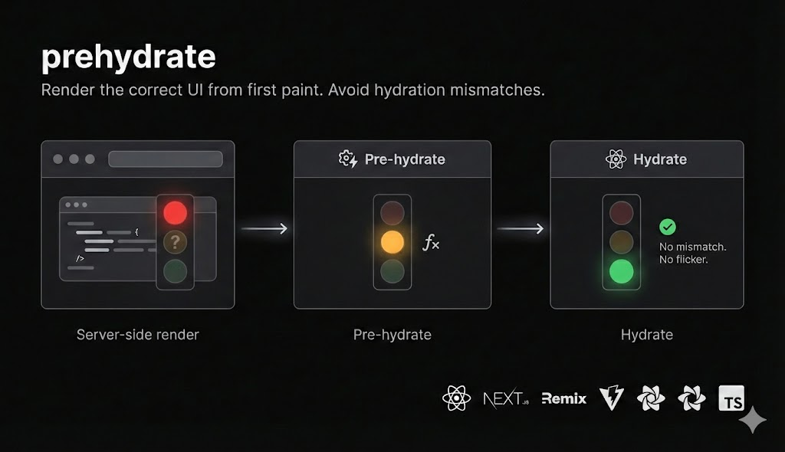

#



[](https://www.npmjs.com/package/prehydrate)
[](https://packagephobia.com/result?p=prehydrate)
[](https://www.typescriptlang.org/)
[](./LICENSE)

---

## The moment that matters

You've built a beautiful clock component. It works perfectly in development. But in production, something's off.

When users first load your page, they see the clock frozen at **3:42 PM** — the exact time your site was built. For a brief moment, your app looks broken. Then React loads, the clock jumps to the correct time, and everything starts working.

**That moment? That's the problem Prehydrate solves.**

## What users see

**Without Prehydrate:**

1. Wrong content (build-time values)
2. Content jumps when React loads
3. App becomes interactive

**With Prehydrate:**

1. Correct content from the start
2. App becomes interactive

The "wrong content" phase disappears entirely.

## Install

```bash
npm install prehydrate
```

## Quick example

Here's a clock that shows the correct time the instant the page loads:

```tsx
import { prehydrate } from 'prehydrate';
import { useState, useEffect } from 'react';

function Clock({ bind }) {
  const [time, setTime] = useState(() => {
    const props = bind('time');
    return props.time || new Date();
  });

  useEffect(() => {
    const interval = setInterval(() => setTime(new Date()), 1000);
    return () => clearInterval(interval);
  }, []);

  return <div>{time.toLocaleTimeString()}</div>;
}

const { Prehydrate, bind } = prehydrate({
  key: 'clock',
  initialState: () => new Date(),  // Runs when page loads, not at build time
});

export function PrehydratedClock() {
  return (
    <Prehydrate>
      <Clock bind={bind} />
    </Prehydrate>
  );
}
```

**The key:** `initialState: () => new Date()` is a function. It runs when the page loads, not when the server builds — so users always see the current time.

## When you need Prehydrate

Any time your server-rendered content could be "wrong" when users first see it:

- **Clocks and timers** — Show the current time, not build time
- **Countdowns** — "Sale ends in 2 hours" shouldn't show yesterday's countdown
- **User preferences** — Dark mode, locale, timezone
- **Live data** — Stock prices, scores, availability
- **Personalization** — "Good morning" at 10 PM looks broken

## How it works

```
HTML loads          Prehydrate runs       React hydrates
(build-time data)   (fresh data)          (interactive)
     |                   |                     |
     v                   v                     v
   0ms               ~50ms                  ~200ms
```

A tiny inline script runs the instant the browser parses your HTML — before React even starts downloading. By the time React loads, the DOM already shows the correct values.

## More examples

### Authentication state

Read auth from cookies before React loads:

```tsx
const { Prehydrate, bind } = prehydrate({
  key: 'auth',
  initialState: () => {
    return document.cookie.includes('session=')
      ? 'Welcome back!'
      : 'Sign in';
  },
});
```

### Theme from localStorage

No more flash of wrong theme:

```tsx
const { Prehydrate, bind } = prehydrate({
  key: 'theme',
  initialState: () => localStorage.getItem('theme') || 'light',
});
```

### User's timezone

Show times in their timezone from the start:

```tsx
const { Prehydrate, bind } = prehydrate({
  key: 'timezone',
  initialState: () => Intl.DateTimeFormat().resolvedOptions().timeZone,
});
```

## Framework support

Works with any React SSR framework:

- **Next.js** (App Router & Pages Router)
- **Vite SSR**
- **Remix**
- **Any SSR setup** using `renderToString` and `hydrateRoot`

### Next.js example

```tsx
// app/components/PrehydratedClock.tsx
'use client';

import { prehydrate } from 'prehydrate';
// ... rest of the clock code
```

## TypeScript

Full type support included:

```tsx
const { Prehydrate, bind } = prehydrate<Date>({
  key: 'clock',
  initialState: () => new Date(),
});
```

## API at a glance

```tsx
const { Prehydrate, bind } = prehydrate({
  key: 'unique-id',           // Identifies this component
  initialState: () => value,  // Runs when page loads
  deps: { helpers },          // Optional helper functions
});

// In your component:
const [state] = useState(() => {
  const props = bind('state');
  return props.state || fallback;
});

// Wrap it:
<Prehydrate>
  <YourComponent bind={bind} />
</Prehydrate>
```

## Documentation

For complete documentation, examples, and API reference:

**[Read the docs →](https://docs.gruckion.com)**

## Contributing

```bash
git clone https://github.com/gruckion/prehydrate
cd prehydrate
pnpm install
pnpm dev
```

## License

MIT
