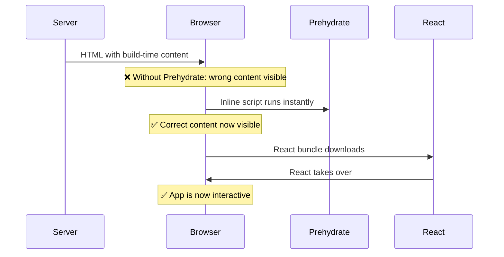

## The user's experience

Without Prehydrate, users see three distinct moments:

1. **Wrong content** — The page loads with stale/build-time values
2. **Content jumps** — React loads and suddenly updates everything
3. **Interactive** — The app works normally

With Prehydrate, users see:

1. **Correct content** — The right values appear instantly
2. **Interactive** — React loads and the app works normally

The "wrong content" phase disappears entirely.

## What happens behind the scenes



### Phase 1: Server renders

Your server builds the HTML. Any dynamic values (like the current time) are frozen at whatever they were during the build.

```html
<!-- User sees this immediately -->
<div id="prehydrate-clock">
  <div>3:42:15 PM</div>  <!-- Build time, not current time! -->
</div>
```

### Phase 2: Prehydrate runs

A tiny inline script executes the instant the browser parses it — before React's JavaScript even starts downloading. This script:

- Evaluates `() => new Date()` with the **current** time
- Updates the DOM immediately

```html
<!-- After prehydrate (milliseconds later) -->
<div id="prehydrate-clock">
  <div>9:15:42 AM</div>  <!-- Correct time! -->
</div>
```

### Phase 3: React takes over

React loads, hydrates, and your app becomes fully interactive. Because the DOM already shows the correct values, there's no jump or flash.

## Why inline scripts?

Prehydrate uses inline `<script>` tags because they execute **synchronously** as the browser parses the HTML. This means:

- No waiting for external scripts to download
- No waiting for React to load
- No waiting for anything

The correction happens in milliseconds, often before users even perceive the initial content.

## The `bind()` connection

The `bind()` function is what connects your React component to the prehydrated state:

```tsx
const [time, setTime] = useState(() => {
  const props = bind('time');
  return props.time || new Date();
});
```

When React finally loads:
- `bind()` returns an empty object
- Your component uses its fallback (`new Date()`)
- The DOM already matches, so there's no visual change

The user never sees the transition. It just works.
